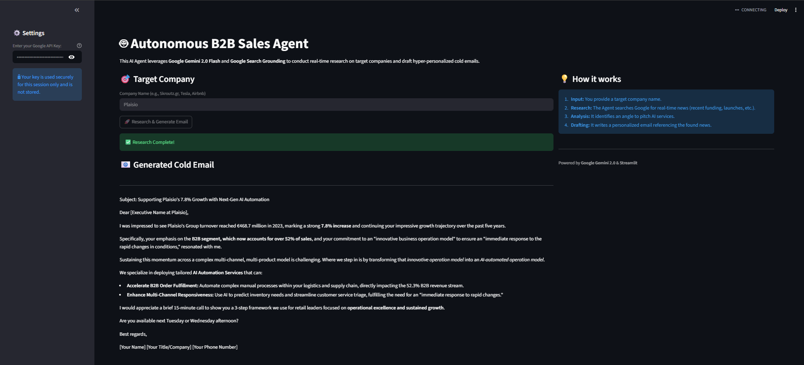

# 🤖 Autonomous B2B Sales Agent (Web App)

An intelligent **AI Sales Development Representative (SDR)** built with **Streamlit** and **Google Gemini 2.0 Flash**. This application performs real-time web research on target companies and generates hyper-personalized cold emails using Google Search Grounding.

## 💼 Business Value & ROI

| | |
|---|---|
| **Problem** | Sales teams spend **60% of their time** on repetitive tasks — prospecting, follow-ups, and data entry — leaving less time for closing deals. |
| **Solution** | An AI-powered agent that **automates lead qualification, outreach sequences, and CRM updates**, so reps can focus on high-value conversations. |
| **ROI** | Frees **10+ hours per week per sales rep**, increasing pipeline capacity without adding headcount. |
| **Target User** | Sales managers, B2B companies, and revenue operations teams looking to scale outbound without scaling costs. |

---

## 📸 Interface Demo
Here is the agent in action via the Streamlit Web Interface:



## 🚀 Key Features
* **Web Interface (GUI):** User-friendly dashboard built with Streamlit (no code required).
* **Real-Time Research:** Uses **Google Search Grounding** to find the latest news, funding rounds, and product launches.
* **Contextual Copywriting:** Drafts emails that specifically reference the live data found.
* **PDF Export:** 📄 Instantly download the generated email as a professional PDF file.
* **Secure:** API Keys are handled securely via the sidebar.

## 📋 Example Usage Case
**Input Target:** "Plaisio.gr"

**Agent Findings:**
* Identified recent turnover of "Plaisio.gr".
* Identified focus on e-commerce optimization.

**Generated Email Output:**
> **Subject:** Congrats on the turnover - A thought on internal scale
>
> Hi [Name],
>
> "I was impressed to see Plaisio's Group turnover reached €468.7 million in 2023, marking a strong 7.8% increase and continuing your impressive growth trajectory over the past five years...."


## 💻 How to Run Locally
1.  **Clone the repository:**
    ```bash
    git clone [https://github.com/stergios-ziliaskopoulos/B2B-Sales-Agent.git](https://github.com/stergios-ziliaskopoulos/B2B-Sales-Agent.git)
    ```
2.  **Install dependencies:**
    ```bash
    pip install -r requirements.txt
    ```
3.  **Run the App:**
    ```bash
    streamlit run app.py
    ```

## 🛠️ Tech Stack
* **Frontend:** Streamlit
* **AI Model:** Gemini 2.0 Flash
* **Utilities:** FPDF (for PDF generation)

---
*Developed by Stergios Ziliaskopoulos - AI Automation Expert*


